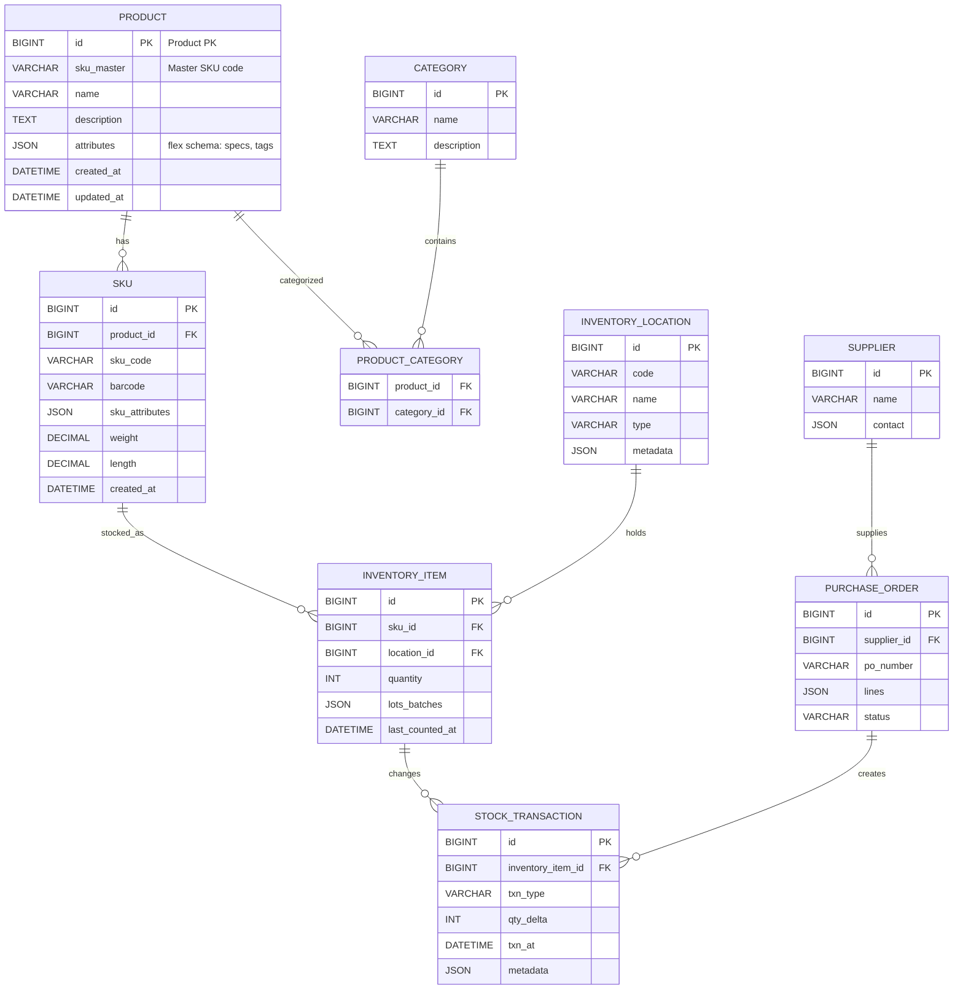

# Chat Transcript: Hybrid Product & Inventory Database Design
**Date:** February 6, 2026  
**Topic:** Designing a hybrid relational + NoSQL MySQL schema for products and inventory  
**Branch:** `feature/hybrid-product-inventory-erd`  
**Reference:** Chapter 3, *The Data Model Resource Book* (Last Revised Edition) by Len Silverstone

---

## Summary

Designed and implemented a **hybrid relational + JSON** MySQL database schema for product catalog and inventory management. The model combines strict relational integrity for transactional data with flexible NoSQL-style JSON columns for evolving product attributes.

**Files Created:**
- `db/migrations/001_create_schema.sql` — Complete MySQL DDL for all tables
- `db/example_queries.sql` — Common operations (search, reserve stock, FIFO lot reduction, PO receipt)
- `docs/ERD.mmd` — Mermaid entity-relationship diagram source
- `docs/ERD_README.md` — Instructions for generating PNG/SVG from Mermaid
- `docs/IMPLEMENTATION_NOTES.md` — Architecture notes and best practices

---

## Entity-Relationship Diagram (Mermaid)



---

## Design Rationale

### Core Entities

1. **PRODUCT** — Master product record
   - `id` (PK), `sku_master` (master SKU), `name`, `description`
   - `attributes` (JSON) — flexible product specs, tags, manufacturer, color, etc.
   - Timestamps for audit

2. **SKU** — Physical item variants (size, color, weight)
   - Links to `PRODUCT` (1:many)
   - `sku_attributes` (JSON) — variant-specific properties
   - Barcode, weight, length for fulfillment

3. **CATEGORY** + **PRODUCT_CATEGORY** — Many-to-many classification
   - Supports product appearing in multiple categories

4. **INVENTORY_LOCATION** — Warehouses, stores, bins
   - `metadata` (JSON) — location-specific config, climate control, security level, etc.

5. **INVENTORY_ITEM** — Stock balance per SKU per location
   - `quantity` (INT) — current on-hand balance
   - `lots_batches` (JSON) — FIFO lot tracking with batch numbers and expiry dates
   - `last_counted_at` — for cycle count scheduling

6. **STOCK_TRANSACTION** — Append-only audit log
   - Records every inventory movement: receipt, reserve, adjustment, shipment
   - `txn_type` (receipt, reserve, adjust, shipment, etc.)
   - `qty_delta` (signed integer: +ve for inbound, -ve for outbound)
   - `metadata` (JSON) — order ID, reason codes, user notes

7. **SUPPLIER** + **PURCHASE_ORDER** — Sourcing
   - `contact` (JSON) — supplier email, phone, address, payment terms
   - PO `lines` (JSON) — line items with SKU, qty, unit cost (denormalized for flexibility)

### Hybrid Relational + NoSQL Features

| Feature | Relational | JSON |
|---------|-----------|------|
| **Product Attributes** | Fixed schema | `attributes` JSON: evolves without migrations |
| **Lot Tracking** | Normalized tables (complex) | `lots_batches` JSON array: simple, flexible |
| **PO Lines** | Separate table | `lines` JSON: denormalized for auditing |
| **Location Metadata** | NULL columns | `metadata` JSON: extensible |
| **Inventory Balance** | Strict INT in `inventory_item.quantity` | Computed from `stock_transaction` audit log |
| **Search/Filtering** | Generated columns + indexes | Full-text or Elasticsearch integration |

---

## Key Design Decisions

### 1. Transactional Integrity
- **inventory_item.quantity** is the single source of truth for current balance
- Every balance change is wrapped in a transaction:
  ```sql
  START TRANSACTION;
  UPDATE inventory_item SET quantity = ... WHERE ... FOR UPDATE;
  INSERT INTO stock_transaction (...) VALUES (...);
  COMMIT;
  ```
- `stock_transaction` is append-only for immutable audit trail

### 2. JSON Indexes (Generated Columns)
- Example: Index `manufacturer` from `product.attributes ->'$.manufacturer'`
  ```sql
  ALTER TABLE product
    ADD COLUMN manufacturer VARCHAR(200) GENERATED ALWAYS AS (JSON_UNQUOTE(JSON_EXTRACT(attributes, '$.manufacturer'))) STORED;
  CREATE INDEX idx_product_manufacturer ON product(manufacturer);
  ```
- Enables fast WHERE clauses on JSON keys without full table scans

### 3. Lot FIFO
- `lots_batches` stored as JSON array:
  ```json
  [
    {"lot":"L2026-01-01","qty":100,"received_at":"2026-01-01T10:00:00Z","expiry":"2027-01-01"},
    {"lot":"L2026-01-15","qty":50,"received_at":"2026-01-15T14:30:00Z","expiry":"2027-01-15"}
  ]
  ```
- Application code iterates oldest lots first, updates JSON, and records `stock_transaction` entries
- Maintains flexibility for different lot schemes (serial numbers, expiry dates, quality grades)

### 4. Scalability Patterns
- **Read-heavy catalog (storefront):** Materialize denormalized product view or push to Elasticsearch; sync on product/SKU changes
- **High-volume stock movements:** Partition `stock_transaction` by date; compute balances asynchronously
- **Multi-location/regional sharding:** Shard inventory by `location_id`

---

## SQL Schema Overview

### DDL Highlights

```sql
CREATE TABLE product (
  id BIGINT AUTO_INCREMENT PRIMARY KEY,
  sku_master VARCHAR(100) NOT NULL,
  name VARCHAR(255) NOT NULL,
  description TEXT,
  attributes JSON NULL,
  created_at TIMESTAMP DEFAULT CURRENT_TIMESTAMP,
  updated_at TIMESTAMP DEFAULT CURRENT_TIMESTAMP ON UPDATE CURRENT_TIMESTAMP,
  INDEX (sku_master),
  FULLTEXT KEY ft_name (name)
) ENGINE=InnoDB;

CREATE TABLE inventory_item (
  id BIGINT AUTO_INCREMENT PRIMARY KEY,
  sku_id BIGINT NOT NULL,
  location_id BIGINT NOT NULL,
  quantity INT NOT NULL DEFAULT 0,
  lots_batches JSON NULL,
  last_counted_at DATETIME NULL,
  FOREIGN KEY (sku_id) REFERENCES sku(id),
  FOREIGN KEY (location_id) REFERENCES inventory_location(id),
  UNIQUE KEY ux_sku_location (sku_id, location_id)
) ENGINE=InnoDB;

CREATE TABLE stock_transaction (
  id BIGINT AUTO_INCREMENT PRIMARY KEY,
  inventory_item_id BIGINT NOT NULL,
  txn_type VARCHAR(50) NOT NULL,
  qty_delta INT NOT NULL,
  txn_at TIMESTAMP DEFAULT CURRENT_TIMESTAMP,
  metadata JSON NULL,
  FOREIGN KEY (inventory_item_id) REFERENCES inventory_item(id)
) ENGINE=InnoDB;
```

Full DDL: see `db/migrations/001_create_schema.sql`

---

## Example Queries

### 1. Search Products by Attribute
```sql
SELECT id, sku_master, name, JSON_EXTRACT(attributes, '$.color') AS color
FROM product
WHERE manufacturer = 'Acme Corp';
```

### 2. Total Inventory for an SKU (All Locations)
```sql
SELECT s.sku_code, SUM(ii.quantity) AS total_qty
FROM sku s
JOIN inventory_item ii ON ii.sku_id = s.id
WHERE s.sku_code = 'SKU-12345'
GROUP BY s.sku_code;
```

### 3. Reserve Stock (Transactional)
```sql
START TRANSACTION;
SELECT * FROM inventory_item WHERE sku_id = 1 AND location_id = 1 FOR UPDATE;
UPDATE inventory_item SET quantity = quantity - 2 WHERE sku_id = 1 AND location_id = 1 AND quantity >= 2;
INSERT INTO stock_transaction (inventory_item_id, txn_type, qty_delta, metadata)
VALUES (1, 'reserve', -2, JSON_OBJECT('order_id', 'ORD-1001'));
COMMIT;
```

### 4. Receive Purchase Order (with Lot Tracking)
```sql
START TRANSACTION;
INSERT INTO inventory_item (sku_id, location_id, quantity, lots_batches)
VALUES (1, 1, 100, JSON_ARRAY(JSON_OBJECT('lot','L2026-01-01','qty',100,'received_at',NOW())))
ON DUPLICATE KEY UPDATE 
  quantity = quantity + VALUES(quantity),
  lots_batches = JSON_ARRAY_APPEND(COALESCE(lots_batches, JSON_ARRAY()), '$', JSON_OBJECT('lot','L2026-01-01','qty',100,'received_at',NOW()));
INSERT INTO stock_transaction (inventory_item_id, txn_type, qty_delta, metadata)
VALUES (LAST_INSERT_ID(), 'po_receipt', 100, JSON_OBJECT('po_number','PO-2026-0001'));
COMMIT;
```

### 5. Audit: All Transactions for an SKU
```sql
SELECT st.*
FROM stock_transaction st
JOIN inventory_item ii ON st.inventory_item_id = ii.id
JOIN sku s ON ii.sku_id = s.id
WHERE s.sku_code = 'SKU-12345' AND st.txn_at BETWEEN '2026-01-01' AND '2026-12-31'
ORDER BY st.txn_at;
```

Full example queries: see `db/example_queries.sql`

---

## NoSQL vs. Relational Trade-offs

### Keep Relational
- ✅ Inventory balances (ACID guarantees)
- ✅ Foreign key constraints (referential integrity)
- ✅ Transaction logs / audit trails
- ✅ POs and supplier relationships
- ✅ Indexed searches on common fields

### Use JSON Flexibility
- ✅ Product specs (color, size, material, certifications)
- ✅ SKU-level attributes (variant metadata)
- ✅ Lot/batch tracking (evolving lot schemes)
- ✅ Location metadata (climate, security, custom fields)
- ✅ Contact info (address, phone, email in one cell)
- ✅ PO line denormalization (capture full details at order time)

---

## Implementation Best Practices

1. **Transactions for consistency:** Wrap inventory updates + stock_transaction inserts in START TRANSACTION…COMMIT
2. **Generated column indexes:** For JSON keys used in WHERE clauses, create generated columns and index them
3. **Application validation:** Validate JSON schema at app layer (or use MySQL 8.0.17+ JSON_SCHEMA_VALIDATE)
4. **Read models:** Materialize denormalized views for storefront/search; update asynchronously
5. **Lot consumption logic:** Implement FIFO iteration in application code or stored procedures; update JSON carefully
6. **Event sourcing option:** For ultra-high-volume stock events, consider append-only event log (NoSQL or partitioned relational) + asynchronous balance materialization
7. **Backups:** JSON is portable across MySQL 5.7+ and 8.0+; test migration before production
8. **Sharding strategy:** Shard by location_id for multi-region inventory systems

---

## Next Steps (User's Notes)

- [ ] Try converting `ERD.mmd` to MySQL Workbench `.mwb` format (reverse-engineer from SQL DDL)
- [ ] Generate PNG/SVG from Mermaid using `mermaid-cli`: `mmdc -i docs/ERD.mmd -o docs/ERD.png`
- [ ] Run SQL sanity check in local MySQL (Step 3, deferred)
- [ ] Create read-model views for storefront
- [ ] Implement lot FIFO consumption logic in app layer
- [ ] Set up Elasticsearch for full-text product search
- [ ] Configure event log for real-time inventory sync

---

## Files in This Branch

```
feature/hybrid-product-inventory-erd
├── db/
│   ├── migrations/
│   │   └── 001_create_schema.sql          ← Full DDL
│   └── example_queries.sql                ← Query examples
├── docs/
│   ├── ERD.mmd                            ← Mermaid diagram source
│   ├── ERD_README.md                      ← How to generate PNG/SVG
│   ├── IMPLEMENTATION_NOTES.md            ← Architecture notes
│   └── CHAT_TRANSCRIPT.md                 ← This file
```

**Branch tip:** `feature/hybrid-product-inventory-erd` (ready for PR to `main`)

---

**Generated:** February 6, 2026  
**Status:** Ready for review and MySQL Workbench `.mwb` conversion
